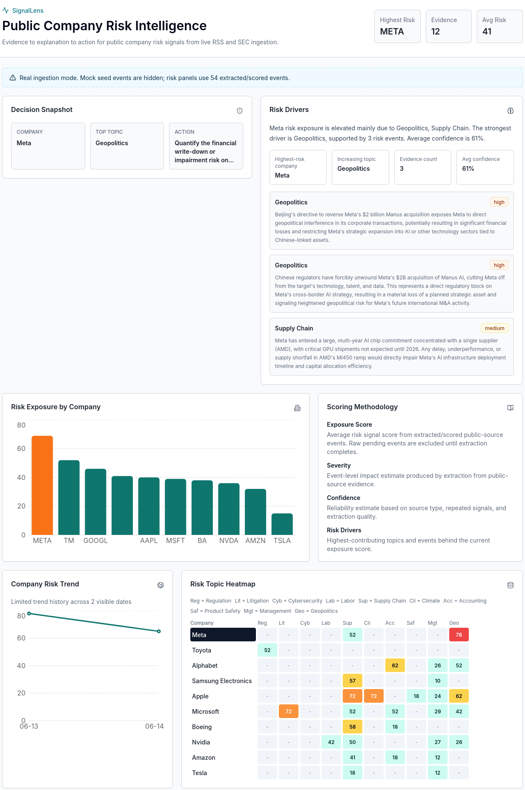
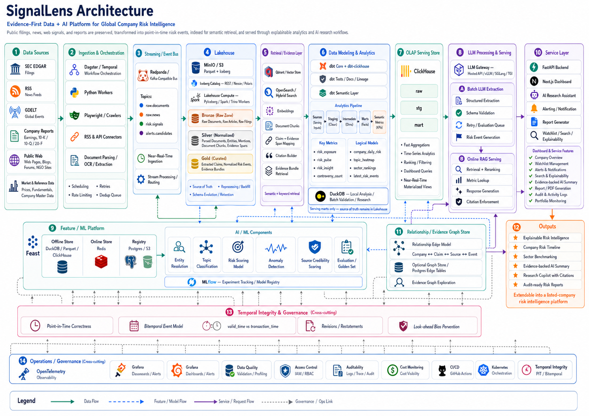

# SignalLens

SignalLens is an AI-assisted public company risk intelligence dashboard. It helps analysts move from evidence to explanation to action:

1. identify which companies have elevated risk signals,
2. understand the topic drivers behind the signal,
3. inspect source evidence and suggested follow-up actions,
4. compare portfolio exposure across public companies,
5. monitor how extracted risk changes over time.

The local demo supports two operating modes:

- **Real ingestion mode**: live RSS/SEC ingestion, Anthropic-based extraction/scoring, scored dashboard views, and hidden mock seed events.
- **Seeded demo mode**: deterministic mock events for product workflow and data-model validation.

## Dashboard Preview



## Architecture



## Current Features

- Real RSS and SEC ingestion workers backed by Celery and Redis
- Anthropic structured extraction for topic, severity, confidence, evidence excerpt, risk score, and suggested action
- No-material-risk handling so weak or indirect articles can be excluded from risk panels
- Real ingestion dashboard mode that hides seeded mock events
- Portfolio exposure chart, selected-company trend, and topic heatmap
- Latest events table with source links, evidence excerpts, score/status, and suggested actions
- Company Detail drawer with provisional low-confidence summaries, topic drivers, evidence list, and related events
- Tenant-aware company watchlists and scoped read APIs
- Basic auth endpoints with JWT bearer tokens
- Alert rule CRUD with email/webhook delivery hooks
- Optional OpenAI embeddings for vector search
- Optional ClickHouse event sync after extraction
- SlowAPI rate limiting backed by Redis

## Stack

- Frontend: Next.js App Router, TypeScript, Tailwind CSS, shadcn-style UI primitives, Recharts
- Backend: FastAPI, SQLModel, SQLAlchemy, Alembic
- Data: PostgreSQL with `pgvector`, Redis, optional ClickHouse
- Workers: Celery worker plus beat scheduler
- Providers: Anthropic for extraction/summarization, optional OpenAI embeddings
- Local runtime: Docker Compose

## Run Locally

Create a local environment file:

```bash
cp .env.example .env
```

For real extraction/scoring, set at least:

```bash
ANTHROPIC_API_KEY=your_key_here
REAL_INGESTION_MODE=true
```

Start the stack:

```bash
docker compose up --build
```

Open:

- Frontend: http://localhost:3000
- API docs: http://localhost:8000/docs
- Health check: http://localhost:8000/health

If a local port is already occupied:

```bash
BACKEND_PORT=8010 FRONTEND_PORT=3010 POSTGRES_PORT=5433 docker compose up --build
```

The backend runs migrations and `python -m app.seed` on startup so base companies, topics, and demo data exist locally. In `REAL_INGESTION_MODE=true`, read APIs hide mock seed events and show real ingested/scored rows instead.

## Running Ingestion and Extraction

Celery beat schedules the main jobs automatically:

- `app.worker.ingest_sec`: daily SEC ingestion
- `app.worker.ingest_rss`: hourly RSS ingestion
- `app.worker.extract_pending`: hourly extraction/scoring for raw events
- `app.worker.summarize_companies`: daily company summaries
- `app.worker.check_alerts`: hourly alert checks

To trigger a task manually:

```bash
docker compose exec backend python - <<'PY'
from app.worker import ingest_rss, ingest_sec, extract_pending

ingest_rss.delay()
ingest_sec.delay()
extract_pending.delay()
PY
```

Raw ingested rows remain pending until `extract_pending` runs with `ANTHROPIC_API_KEY` configured. Events that do not contain a directly material company-specific risk are marked `error` with a no-material-risk message and excluded from scored dashboard panels.

## Data Flow

```text
RSS / SEC sources
  -> ingestion pipeline
  -> RiskEvent(status="raw") in PostgreSQL
  -> Celery extract_pending
  -> Anthropic structured extraction
  -> RiskEvent(status="extracted") with score, severity, topic, evidence
  -> optional OpenAI embedding
  -> optional ClickHouse sync
  -> FastAPI dashboard/search/events APIs
  -> Next.js dashboard
```

In real ingestion mode, the dashboard uses scored/extracted/published events with material confidence and reports pending raw counts separately. This prevents raw zero-score rows from diluting risk exposure.

## API Overview

Read APIs:

- `GET /health`
- `GET /companies`
- `GET /topics`
- `GET /events?limit=50`
- `GET /dashboard`
- `GET /search?q=...`

Auth and tenancy:

- `POST /auth/register`
- `POST /auth/login`
- `GET /auth/me`
- `GET /watchlist`
- `POST /watchlist/{company_id}`
- `DELETE /watchlist/{company_id}`

Alert rules:

- `GET /alerts/rules`
- `POST /alerts/rules`
- `PUT /alerts/rules/{rule_id}`
- `DELETE /alerts/rules/{rule_id}`

When authenticated, company/event/dashboard reads are scoped to the tenant watchlist. An empty watchlist returns empty scoped results rather than falling back to all companies.

## Environment

All documented variables are in [.env.example](./.env.example). Common local settings:

| Variable | Purpose |
| --- | --- |
| `REAL_INGESTION_MODE` | Hide mock seed events and show real ingestion/scored rows |
| `ANTHROPIC_API_KEY` | Required for extraction and summarization |
| `ANTHROPIC_EXTRACTION_MODEL` | Extraction model, default `claude-sonnet-4-6` |
| `ANTHROPIC_SUMMARY_MODEL` | Summary model, default `claude-haiku-4-5-20251001` |
| `OPENAI_API_KEY` | Optional embeddings/vector search |
| `CLICKHOUSE_URL` | Optional event sync destination |
| `REDIS_URL` | Celery broker/backend and SlowAPI storage |
| `DATABASE_URL` | PostgreSQL connection URL |
| `ALERT_WEBHOOK_URL` | Optional default webhook for alerts |
| `SMTP_HOST` | Optional SMTP delivery for email alerts |

## Repository Layout

```text
.
├── backend
│   ├── alembic/versions        # database migrations
│   ├── app
│   │   ├── analytics           # alerts and optional ClickHouse sync
│   │   ├── auth                # JWT auth helpers/dependencies
│   │   ├── extraction          # Anthropic extraction, prompts, summaries
│   │   ├── ingestion           # RSS/SEC ingestion, entity matching, dedupe
│   │   ├── config.py           # environment-backed settings
│   │   ├── database.py         # SQLModel engine/session setup
│   │   ├── main.py             # FastAPI routes
│   │   ├── models.py           # tables and relationships
│   │   ├── schemas.py          # API response/request models
│   │   ├── seed.py             # base companies/topics/mock events
│   │   └── worker.py           # Celery tasks and schedules
│   └── tests                   # API and contract tests
├── db/init                     # pgvector initialization
├── docs/assets                 # screenshots and architecture image
├── frontend
│   ├── app                     # Next.js routes
│   ├── components/dashboard    # dashboard cards, charts, drawer, table
│   ├── components/ui           # lightweight UI primitives
│   └── lib                     # typed API client and derived dashboard state
└── docker-compose.yml
```

## Data Model Notes

`RiskEvent` is the core evidence object. Important fields include:

- company/topic foreign keys
- `source_type`, `source_name`, `source_url`
- `event_date`, `fetched_at`, `extracted_at`
- `status`: `raw`, `extracted`, `scored`, `published`, `error`
- `retry_count`, `error_message`
- `severity`, `confidence`, `risk_score`, `exposure_score`
- `evidence_excerpt`, `risk_driver_summary`, `suggested_action`
- optional vector `embedding`
- `ingestion_source` and `content_hash` for visibility filtering/deduplication

Dashboard exposure is currently an average risk score over material scored events. Raw pending events are counted separately and are not included in scored exposure panels.

## Testing

Backend:

```bash
cd backend
pytest -q
```

Frontend:

```bash
cd frontend
npm test -- --run
npx tsc --noEmit
```

## Current Limitations

- LLM extraction quality depends on provider output and source text quality.
- Existing extracted rows may need reprocessing when prompts/materiality policy changes.
- Email/webhook alert delivery is configured but not a full notification product.
- ClickHouse and OpenAI embeddings are optional integrations and are skipped when their env vars are empty.
- The frontend is an MVP dashboard, not a full analyst workflow system yet.
